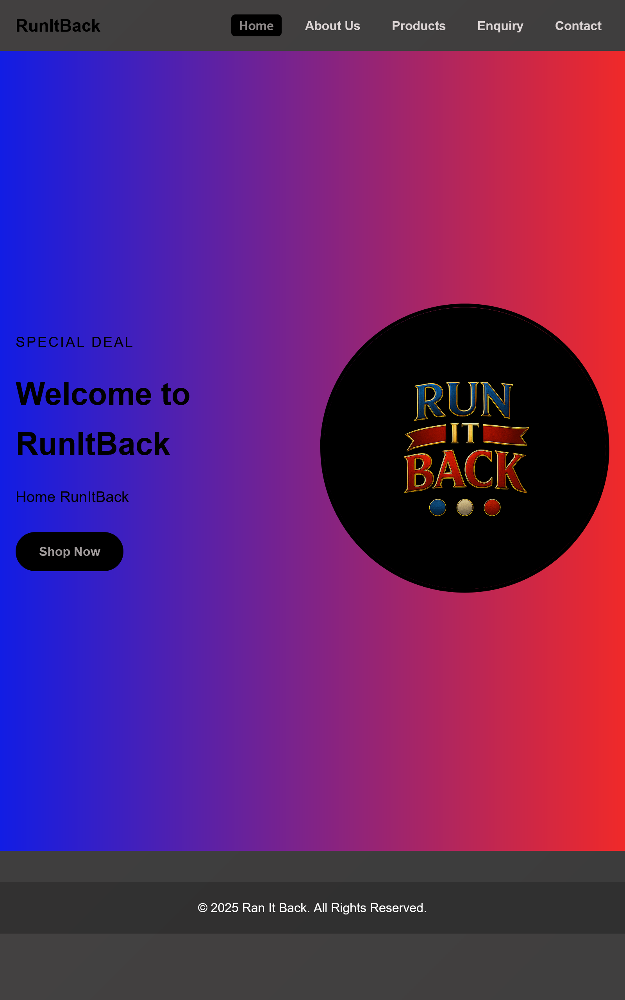
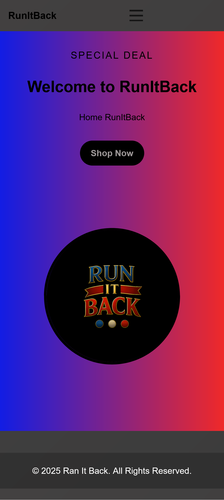
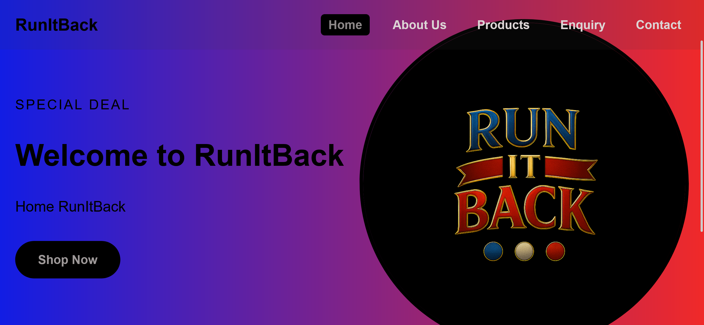

# RunItBack – Modern Streetwear Website

RunItBack is a modern, responsive static website built with HTML, CSS, and JavaScript. Designed to showcase a premium urban fashion brand, it includes multiple pages with enhanced functionality, SEO optimization, and interactive features.

### 1. Search Engine Optimization (SEO)
- **Meta Tags**: Added comprehensive meta descriptions, keywords, and author tags
- **Semantic HTML**: Improved structure with proper heading hierarchy
- **Image Optimization**: Added descriptive alt text and lazy loading
- **SEO Files**: Created `robots.txt` and `sitemap.xml`
- **Mobile Optimization**: Enhanced responsive design

### 2. JavaScript Enhancements
- **Form Validation**: Real-time validation for contact and enquiry forms
- **Interactive Lightbox**: Click-to-enlarge product images
- **Search Functionality**: Live product search and filtering
- **Smooth Animations**: CSS transitions and hover effects
- **Accordion FAQs**: Interactive FAQ section
- **Dynamic Content**: JavaScript-driven user interactions

### 3. Modern Design Improvements
- **CSS Variables**: Consistent design system with custom properties
- **Gradient Backgrounds**: Modern gradient aesthetics
- **Glass Morphism**: Frosted glass effects with backdrop-filter
- **Micro-interactions**: Hover effects and smooth transitions
- **Responsive Grid**: Enhanced product grid layouts

### 4. Form Functionality
- **Contact Form**: Enhanced validation with error messaging
- **Enquiry Form**: Dynamic responses based on enquiry type
- **Success Messages**: User feedback for form submissions
- **Accessibility**: Improved form labels and structure

## 📁 Updated Project Structure
RunItBack/
├── index.html
├── Page/
│ ├── about.html
│ ├── contacts.html
│ ├── enquiry.html
│ ├── products.html
├── css/
│ └── style.css 
├── js/
│ └── script.js 
├── Assets/
│ ├── images/
├── robots.txt 
├── sitemap.xml 
└── README.md

## 🛠 Technical Features

- **Responsive Design**: Mobile-first approach with breakpoints
- **Modern CSS**: Flexbox, Grid, and CSS Variables
- **JavaScript ES6**: Modern syntax and features
- **Form Validation**: Client-side validation with custom messages
- **SEO Ready**: Optimized for search engines
- **Performance**: Optimized images and lazy loading
- **Accessibility**: ARIA labels and semantic HTML

## 📱 Responsive Breakpoints

- **Mobile**: < 480px
- **Tablet**: 768px
- **Desktop**: 1200px+

## 🎨 Design System

- **Primary Colors**: Purple/Blue gradient (#667eea to #764ba2)
- **Secondary Colors**: Pink/Red gradient (#f093fb to #f5576c)
- **Typography**: Inter font family
- **Spacing**: 8px base unit
- **Shadows**: Multi-layer shadow system

## 🔧 Installation & Usage

1. Clone the repository
2. Open `index.html` in a web browser
3. No build process required - static site

## 📈 SEO Features

- Structured data ready
- Optimized meta tags
- XML sitemap
- Robots.txt
- Semantic HTML structure
- Image optimization

## 🐛 Changelog

### v1.2.0 - Enhancement Release (2025-01-15)
- Added comprehensive SEO optimization
- Implemented JavaScript form validation
- Added product image lightbox
- Integrated search functionality
- Enhanced modern design aesthetics
- Improved responsive design
- Added FAQ accordion section
- Created SEO files (robots.txt, sitemap.xml)

### v1.1.0 - Feature Update (2025-09-26)
- Added Products page with categorized listings
- Improved responsiveness and layout consistency
- Embedded Google Maps on Contact page
- Added mobile navigation

### v1.0.0 – Initial Launch (2025-08-27)
- Created homepage with basic layout
- Added About Us, Contact, and Enquiry pages
- Implemented basic site navigation

## 👥 Team

| Name                  | Role                  |
| --------------------- | --------------------- |
| **Nuza Mokoena**      | Founder & CEO         |
| **Kgolofelo Mkhonto** | Operations Manager    |
| **Sandile Mokoena**   | Community Coordinator |

## 📄 License

This is an open project for educational and portfolio use. Attribution appreciated.

## 🔗 References

- [MDN Web Docs](https://developer.mozilla.org/) - Web technologies reference
- [CSS-Tricks](https://css-tricks.com/) - Modern CSS techniques
- [Google Developers](https://developers.google.com/web) - Web best practices
- [Bro Code YouTube Tutorial](https://youtube.com/playlist?list=PLZPZq0r_RZOOxqHgOzPyCzIl4AJjXbCYt) - Learning resource

## 📸 Screenshots

---

**RunItBack** - Where Street Style Meets Premium Comfort