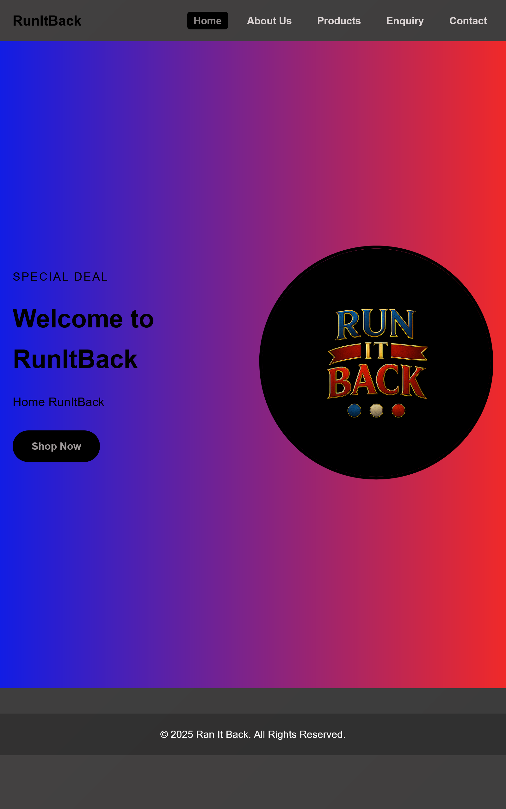
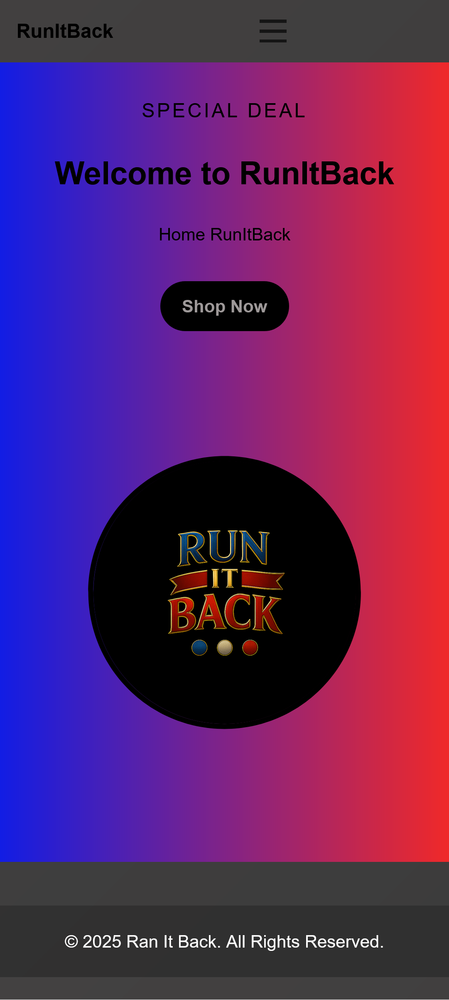
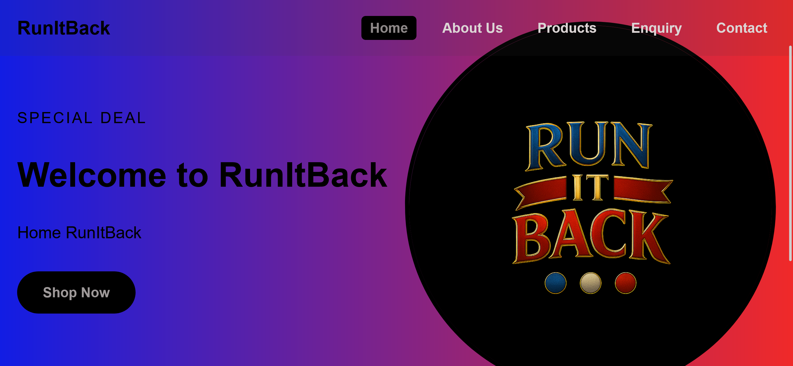

RunItBack – Static Streetwear Website

RunItBack is a modern, responsive static website built with HTML, CSS, and basic JavaScript. Designed to showcase a fictional urban fashion brand, it includes multiple pages covering product listings, contact forms, and brand identity. Ideal for learning and presenting front-end web development skills.

Features

.Fully Responsive Design — Works on desktops, tablets, and mobile devices

.Multi-Page Navigation — Includes Home, About, Products, Enquiry, and Contact pages

.Interactive Navigation Menu — Mobile-friendly hamburger menu for smaller screens

.Product Catalog — Displays sportswear and luxury items with images and pricing

.Contact & Enquiry Forms — Basic forms to collect user messages and feedback

.Map Integration — Embedded Google Maps iframe for location display

.Visuals & Icons — Uses high-quality product images and optional icon libraries (like Font     Awesome)

Project Structure

RunItBack/
├── index.html                → Homepage
├── Pages/
│   ├── about.html            → About Us page
│   ├── contact.html          → Contact form with map
│   ├── enquiry.html          → Custom enquiry form
│   ├── products.html         → Product showcase
├── css/
│   └── style.css             → Global stylesheet
├── assets/
│   ├── images/               → Product and team member images
│   └── fonts/                → (Optional) Google Fonts or custom fonts

Open in Browser

.Open index.html directly in any modern web browser (Chrome, Firefox, Edge, etc.).
.No server or frameworks required – this is a static site.

Dependencies & Resources

.Google Fonts – For typography

.Font Awesome (optional) – For scalable icons

.Responsive Design – Achieved using CSS Flexbox and Media Queries

.Embedded Google Maps – For contact location

Customization Tips

-Update Brand Texts: Edit HTML files like about.html to change the company description or history.

-Change Images: Replace or add new images in the /assets/images/ folder.

-Modify Styling: Tweak fonts, colors, or layout in css/style.css.

-Add Pages: Duplicate an HTML file and link it in the header <nav> section.

Team

| Name                  | Role                  |
| --------------------- | --------------------- |
| **Nuza Mokoena**      | Founder & CEO         |
| **Kgolofelo Mkhonto** | Operations Manager    |
| **Sandile Mokoena**   | Community Coordinator |

Version History

v1.0.0 – Initial Launch (2025-08-27)

Created homepage with basic layout

Added About Us, Contact, and Enquiry pages

Implemented basic site navigation

v1.1.0 – Feature Update (2025-09-26)

Added Products page with categorized listings

Improved responsiveness and layout consistency

Embedded Google Maps on Contact page

Added mobile navigation and form functionality

License

-This is an open project for educational and portfolio use. Attribution appreciated, but not required.

Live Demo

.Coming soon – add GitHub Pages or Netlify deployment link here.

REFERENCES
(bro code, 2023(two years ago))https://youtube.com/playlist?list=PLZPZq0r_RZOOxqHgOzPyCzIl4AJjXbCYt&si=7uGmgD77uVfc4Ck

Screenshort

